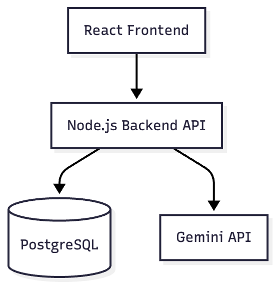
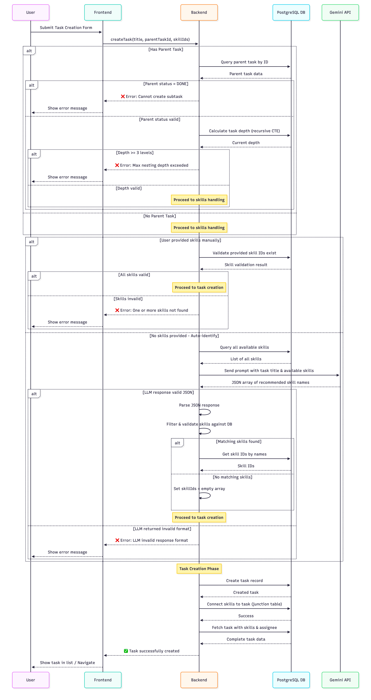

# Task Assignment

A full-stack web application for managing tasks, subtasks, and automated skill identification using AI. Users can create hierarchical tasks with optional subtasks up to 3 levels deep, and the system automatically identifies required skills using Google's Gemini API.

## Table of Contents

- [Tech Stack](#tech-stack)
- [Prerequisites](#prerequisites)
- [Quick Start](#quick-start)
  - [Option 1: Docker Deployment](#option-1-docker-deployment-recommended)
  - [Option 2: Local Development](#option-2-local-development)
- [Environment Variables Reference](#environment-variables-reference)
- [Key Features](#key-features)
- [Architecture & Design](#architecture--design)
  - [Project Structure](#project-structure)
  - [System Architecture](#system-architecture)
  - [Database Schema](#database-schema)
  - [API Design](#api-design)
  - [Dependencies & Justification](#dependencies--justification)
- [Development](#development)
  - [Running Migrations](#running-migrations)
  - [Seeding Data](#seeding-data)
  - [Linting](#linting)
  - [Code Formatting](#code-formatting)

---

## Tech Stack

- **Frontend:** React, TypeScript, Vite, Material-UI, Zustand, tRPC
- **Backend:** Node.js, Express, TypeScript, Prisma, PostgreSQL, tRPC, Gemini API
- **Infrastructure:** Docker, Docker Compose, Nginx

---

## Prerequisites

- [Docker Desktop](https://www.docker.com/products/docker-desktop/) (recommended for easiest setup)
- [Node.js 20+](https://nodejs.org/) (only required for local development)
- [PostgreSQL 16+](https://www.postgresql.org/) (only required for local development without Docker)
- Google Gemini API key (get from https://aistudio.google.com/app/apikeys)

---

## Quick Start

### Clone the Repository
```bash
git clone https://github.com/ijavierja/task-assignment.git
cd task-assignment
```

---

### Option 1: Docker Deployment (Recommended)

Run the entire application (Frontend, Backend, Database) in containers.

#### 1. Configure Environment
```bash
# Copy the template
cp .env.docker .env

# Set: GEMINI_API_KEY=your_gemini_api_key_here
```

#### 2. Start the Application
```bash
docker compose up --build
```

#### 3. Access the Application
- **Frontend:** http://localhost (port 80)
- **Backend API:** http://localhost:3001 (internal, proxied through nginx)
- **Database:** localhost:5432 (internal only)

The frontend is served through Nginx which:
- Serves the React SPA
- Proxies `/trpc/*` requests to the backend
- Handles SPA routing with fallback to index.html
---

### Option 2: Local Development

Run the database in Docker but develop locally with hot-reload.

#### 1. Start Infrastructure (Database Only)
```bash
docker compose up postgres -d
```

#### 2. Backend Setup
Open a new terminal:
```bash
cd backend

# Install dependencies
npm install

# Generate Prisma client (creates types and client)
npx prisma generate

# Run migrations
npm run migrate

# Seed initial data (skills, developers)
npm run seed

# Start dev server with hot reload
npm run dev
```
*Backend runs at http://localhost:3001*

#### 3. Frontend Setup
Open another terminal:
```bash
cd frontend

# Install dependencies
npm install

# Start dev server
npm run dev
```
*Frontend runs at http://localhost:5173*

The frontend dev server automatically proxies API calls to http://localhost:3001 (see `vite.config.ts`)

---

## Environment Variables Reference

### Docker Deployment (`.env.docker`)

| Variable | Required | Default | Description |
|----------|----------|---------|-------------|
| `DB_HOST` | Yes | `postgres` | PostgreSQL hostname |
| `DB_PORT` | Yes | `5432` | PostgreSQL port |
| `DB_USER` | Yes | `postgres` | PostgreSQL username |
| `DB_PASSWORD` | Yes | `postgres` | PostgreSQL password |
| `DB_NAME` | Yes | `task_assignment` | Database name |
| `GEMINI_API_KEY` | Yes | (empty) | Google Gemini API key for AI skill identification |
| `GEMINI_MODEL` | No | `gemini-2.5-flash` | Gemini model to use |
| `PORT` | No | `3001` | Backend port |
| `NODE_ENV` | No | `production` | Node environment |

### Local Development (`.env`)

Same as above, but use:
- `DB_HOST=localhost` (instead of `postgres`)
- `NODE_ENV=development`

---

## Key Features

### 1. Hierarchical Task Management
- Create main tasks with up to 3 levels of nested subtasks
- Each level can have independent assignments and status
- Depth validation prevents accidental circular nesting

### 2. Task Status Logic
- Parent tasks cannot be marked DONE unless all subtasks are DONE
- Once a parent task is marked DONE, all its subtasks are locked and cannot be modified
- Prevents incomplete work from being marked as complete

### 3. LLM-Powered Skill Identification
- Automatically identify required skills using Google Gemini API
- Analyzes task title to match existing skills in the database
- Users can override with manual skill selection
- Graceful error handling if API is unavailable

---

## Architecture & Design

### Project Structure

- `backend/` - Express API, Prisma schema, and tRPC
- `frontend/` - React application
- `db-psql/` - PostgreSQL Docker configuration

### System Architecture



### Database Schema

To view and interact with the database schema visually, you can use Prisma Studio:

```bash
cd backend
npx prisma studio
```

This opens an interactive UI where you can:
- View all database tables and their relationships
- Inspect and edit records
- Understand the database structure and relationships

**Key Design Decisions:**

- **Self-Referential Task Table**: Tasks can have subtasks via `parentTaskId` field, enabling hierarchical nesting
- **Depth Validation**: Backend enforces MAX_SUBTASK_DEPTH = 3 to prevent excessive nesting
- **Ancestor Chain Validation**: Recursive CTE (Common Table Expression) in PostgreSQL prevents circular references
- **Many-to-Many Relationships**: Junction tables for Task-Skill and Developer-Skill relationships
- **Indexes**: Created on `assigneeId`, `createdAt`, and `parentTaskId` for query optimization

### API Design

The backend uses **tRPC** (Tiny RPC) for type-safe APIs:

**Advantages of tRPC:**
- End-to-end type safety between frontend and backend
- Automatic code generation for frontend client
- Reduced boilerplate vs REST or GraphQL

**Main Procedures:**

#### Tasks
- `tasks.getAll` - Fetch all tasks with hierarchy
- `tasks.getById` - Get a specific task by ID
- `tasks.create` - Create task with optional skills and subtasks
- `tasks.updateStatus` - Update task status
- `tasks.assignDeveloper` - Assign developer to task
- `tasks.getAvailableAssignees` - Get developers available for assignment
- `tasks.getSubtasks` - Get subtasks for a specific task

#### Developers
- `developers.getAll` - Get all developers
- `developers.getById` - Get a specific developer by ID

#### Skills
- `skills.getAll` - Get all skills
- `skills.getById` - Get a specific skill by ID

**LLM Integration:**
- When task is created without skills, `identifySkillsFromTask` calls Gemini API
- Extracts task title and analyzes it to match existing skills
- If API fails, returns specific error (not silently failing)

#### Task Creation & Skills Generation Sequence



This sequence shows:
- Validation of parent task and nesting depth
- Two paths for skill handling: manual selection or LLM-powered auto-identification
- Gemini API integration for intelligent skill matching
- Error handling at each step
- Final task creation and database persistence

### Dependencies & Justification

#### Frontend Dependencies

| Dependency | Version | Justification |
|-----------|---------|--------------|
| `react` | 19 | Latest stable with concurrent features, better performance |
| `@mui/material` | Latest | Quick styling with pre-built components, theming support |
| `zustand` | Latest | Lightweight state management  |
| `@trpc/react-query` | Latest | Type-safe RPC client with React Query integration |
| `vite` | Latest | Fast build tool, instant HMR, optimized production builds |

#### Backend Dependencies

| Dependency | Version | Justification |
|-----------|---------|--------------|
| `express` | ^5 | Lightweight, flexible web framework (industry standard) |
| `@prisma/client` | ^7 | Type-safe ORM with excellent TypeScript support |
| `prisma` | ^7 | Schema management and migrations |
| `@trpc/server` | Latest | Type-safe API framework (reduces bugs, improves DX) |
| `@google/genai` | Latest | Google Gemini API for AI skill identification |
| `zod` | ^4 | Runtime schema validation, type inference |

#### Why These Choices?

1. **tRPC**: 
   - Enables full TypeScript integration across frontend and backend with no schema duplication
   - Automatically generates type-safe client code on the frontend
   - Prevents mismatches between frontend and backend APIs through shared types
   - **Con:** Requires frontend and backend code to reside in the same repository

2. **PostgreSQL**:
   - Enforces strict relationships between tasks, subtasks, developers, and skills through foreign keys
   - Recursive CTEs enable validation of hierarchical relationships
   - ACID compliance
   - Advanced features (window functions, trigrams) support future query optimizations

3. **Prisma**:
   - Generates type-safe database queries directly from schema, reducing runtime errors
   - Built-in migration system manages schema changes safely and versioned
   - Handles complex queries like recursive CTEs that validate task hierarchies

4. **Zustand**:
   - Minimal boilerplate makes state management straightforward for this project's scope
   - Perfect fit for managing task creation flow state without over-engineering
   - Hook-based approach integrates naturally with React components

5. **Zod**:
   - Validates API inputs at runtime to catch data shape errors before processing
   - Infers TypeScript types from validation schemas, keeping types synchronized
   - Provides clear, actionable error messages when validation fails

---

## Development

### Running Migrations

Create a new migration after schema changes:
```bash
cd backend
npx prisma migrate dev --name describe_your_change
```

Apply pending migrations:
```bash
npm run migrate
```

### Seeding Data

Run the seed script to populate initial data:
```bash
cd backend
npm run seed
```

Seed includes:
- Skills (Frontend, Backend, Design, DevOps, etc.)
- Sample Developers with assigned skills

### Linting

Check code quality:
```bash
# Backend
cd backend && npm run lint

# Frontend
cd frontend && npm run lint
```

Fix linting issues automatically:
```bash
# Backend
cd backend && npm run lint:fix

# Frontend
cd frontend && npm run lint:fix
```

### Code Formatting

Format code with Prettier:
```bash
# Backend
cd backend && npm run format

# Frontend
cd frontend && npm run format
```
